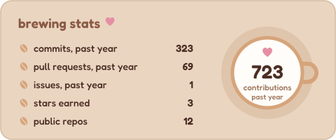
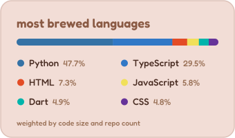
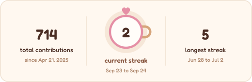

<picture>
  <source media="(prefers-color-scheme: dark)" srcset="./assets/banner-dark.svg">
  
</picture>

 

<picture>
  <source media="(prefers-color-scheme: dark)" srcset="./assets/divider-dark.svg">
  
</picture>

### ✦ growing grass 草

  <picture>
    <source media="(prefers-color-scheme: dark)" srcset="https://raw.githubusercontent.com/neilacapuccino/neilacapuccino/output/snake-dark.svg">
    
  </picture>

### ✦ tools of the trade 使っている技術

<picture>
  <source media="(prefers-color-scheme: dark)" srcset="https://skillicons.dev/icons?i=ts%2Creact%2Cnextjs%2Ctailwind%2Cprisma%2Cpostgres%2Cvercel%2Cvite%2Cpy%2Cflutter%2Cgit%2Cgithub%2Cgithubactions%2Cps&theme=dark&perline=7">
  
</picture>

plus tRPC, TanStack Query, Zod and Neon Postgres on the backend side

<picture>
  <source media="(prefers-color-scheme: dark)" srcset="./assets/divider-dark.svg">
  
</picture>

### ✦ on the menu 作品

<table align="center">
  <tr>
    <th></th><th align="left">project</th><th align="left">what it is</th><th align="left">brewed with</th>
  </tr>
  <tr>
    <td>🏦</td>
    <td><a href="https://github.com/neilacapuccino/gobank-express"><b>GoBank Express</b></a></td>
    <td>mobile first neobank with goal based savings, instant transfers, bill pay and rewards</td>
    <td>Next.js · tRPC · Prisma · Neon</td>
  </tr>
  <tr>
    <td>🗺️</td>
    <td><a href="https://github.com/YusCML/6SEven"><b>6SEven</b></a></td>
    <td>map based web app built with a team</td>
    <td>T3 stack</td>
  </tr>
  <tr>
    <td>🛍️</td>
    <td><a href="https://github.com/neilacapuccino/gearhub"><b>GearHub</b></a> <a href="https://lab-2-se2.vercel.app">live demo ↗</a></td>
    <td>tech accessories storefront with filters, a cart and simulated checkout</td>
    <td>React 19 · Vite · Tailwind 4</td>
  </tr>
  <tr>
    <td>🎓</td>
    <td><a href="https://github.com/zarkysgascon/GradeSeer"><b>GradeSeer</b></a></td>
    <td>helps students calculate their grades</td>
    <td>TypeScript</td>
  </tr>
  <tr>
    <td>👁️</td>
    <td><a href="https://github.com/neilacapuccino/omniview-ctrlzhong"><b>OmniView</b></a></td>
    <td>Flutter app with YOLOv5 object detection, scene recognition, hand gestures and image to speech</td>
    <td>Flutter · Python · PyTorch</td>
  </tr>
</table>

<picture>
  <source media="(prefers-color-scheme: dark)" srcset="./assets/divider-dark.svg">
  
</picture>

### ✦ brewing stats 統計

  <picture>
    <source media="(prefers-color-scheme: dark)" srcset="./profile/stats-dark.svg">
    
  </picture>
  <picture>
    <source media="(prefers-color-scheme: dark)" srcset="./profile/top-langs-dark.svg">
    
  </picture>

  <picture>
    <source media="(prefers-color-scheme: dark)" srcset="./profile/streak-dark.svg">
    
  </picture>

  <picture>
    <source media="(prefers-color-scheme: dark)" srcset="./assets/footer-dark.svg">
    
  </picture>

